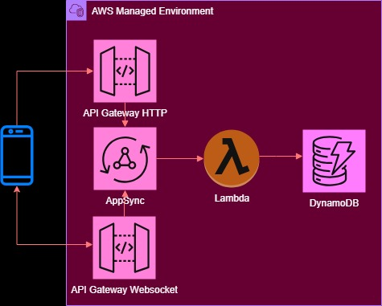

# Lambda-DynamoDB Project

A WORK-IN-PROGRESS

* API GW Http API
* API GW Websockets
* Lambda in Docker
* DynamoDB
* JSON Web Token (JWT)
* CodePipeline
* CloudFormation create and update pipelines
* PyTest

The architecture diagram is below.

  

# TODO

1. Add Lambda Authorizer.
1. Subscriptions 

