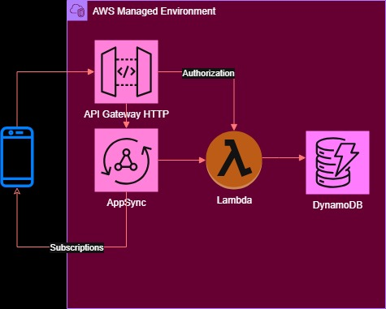

# Project: GraphQL API

This project implements a Query, Mutation, and Subscription GraphQL API using AWS services. The AWS stack was implemented using the following services and frameworks.

* API Gateway Http API - The public face interface to the app which forwards requests to the GraphQL API.
* AppSync - Provides GraphQL API related services and forwards requests to Lambda functions.  
* Lambda Functions - Provides compute resources for GraphQL application and API Gateway authorization.
* DynamoDB - Used for persistence.
* JSON Web Token (JWT) - Used limit app access to logged in users.
* CodePipeline - Provides CD/CI services.  
* CloudFormation - Provides IaC services. 
* PyTest - Used for Python code unit tests.

The architecture diagram is below.

  

This app API supports the following:

1. Create User - A Mutation creating a user.
1. Login - A Query for logging into the application and receiving a JWT.
1. Get User - A Query using the JWT form the login, get user information.
1. Created User - A Subscription to push Create User events to AppSync WSS clients.

The Query and Mutations resolvers were implemented using Lambda Functions. Examples of making calling these endpoints can be found in the Jupyter notebook found in the `client` folder of this project. 

The only work need for the Created User Subscription was updating the schema with a subscription specification, AppSync takes care fo the rest. If more complicated processing was needed, a resolver could have been added. The `client` directory also has an example Subscription client.   

