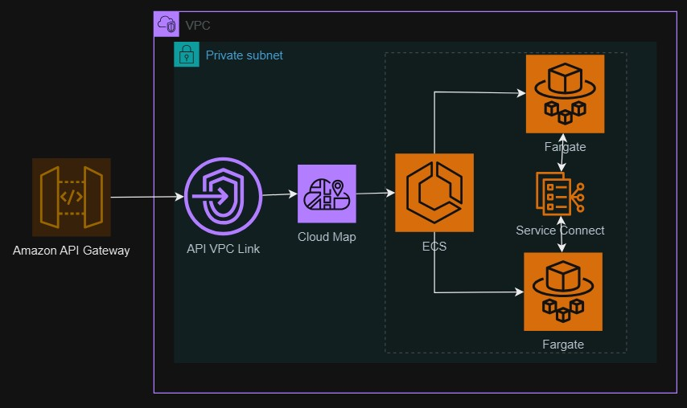

# Project: Integrate ECS Services using Service Connect

## Introduction

This project demonstrates using AWS Service Connect to connect two services within an AWS ECS cluster. The services are deployed to a private subnet in a VPC created for the project. AWS API Gateway is used to expose of the services. To reduce the expense of deploying this project to AWS:

1. Instead of using an application load balancer, Cloud Map is used to integrate AWS API Gateway with ECS. 
1. Only one instance of each service is deployed to a single private subnet, saving on the associated expenses of multiple Fargate tasks and NAT gateways.

Below is a network diagram.

<p align="center">
  
</p>

## The Microservices

The `./docker` folder has two container definitions:

1. Labeling Service: The `./docker/rekog` folder defines a microservice for returning the labels in an image located in AWS S3. AWS Rekognition is used for labeling the images. This service is configured to use AWS Service Connect to expose a DNS Service Connect URL for the FastAPI started in the container. The the only way to access this service is through the Service Connect URL.
1. Upload Service: The `./docker/upload` folder defines a microservice for uploading image files to S3 and calling the Labeling Service for the image labels. This service is also configured to utilize Service Connect to find the Labeling Service's Service Connect URL. The only access to the FastAPI microservice in this container is through the API Gateway.

## AWS Service Connect

[Service Connect](https://docs.aws.amazon.com/AmazonECS/latest/developerguide/service-connect.html) is used to manage service-to-service communications. It provides an easy way to create hostnames by which services can connect to each other. For this project, the CloudFormation file `./cloudforamtion/service-rekog.ymal` configures the hostname `rekog` by which its FastAPI endpoint can be referenced. The Upload Service's Cloudformation configuration sets an environment variable with the value `http://rekog.internal.com:9090/get_image_labels` for request to the Labeling Service. Another benefit of Service Connect is that the proxies created for configured services provide round-robin load balancing. Service Connect uses Cloud Map for service discovery. Cloud Map makes round-robin requests across the tasks in a service as documented [here](https://docs.aws.amazon.com/AWSCloudFormation/latest/UserGuide/aws-resource-apigatewayv2-integration.html#cfn-apigatewayv2-integration-integrationuri) and [here](https://docs.aws.amazon.com/cloud-map/latest/api/API_DiscoverInstances.html).  

## Build and Deploy

The steps below assume you have a running instance of Docker and configured AWS and SAM CLIs. 

## Docker Build

To build the Labeling Service Docker image, execute the following steps.

First login to AWS using your configured AWS CLI:

```bash
aws ecr get-login-password --region us-east-1 | docker login --username AWS --password-stdin <YOUR ACCT ID>.dkr.ecr.us-east-1.amazonaws.com
```

Then build and push the Docker images to AWS ECR. To build and push the Labeling Service:

```bash
cd ./docker/rekog
docker build -t ecs1/rekog .
docker tag ecs1/rekog <YOUR AWS ACCT ID>.dkr.ecr.us-east-1.amazonaws.com/ecs1:rekog
docker push <YOUR AWS ACCT ID>.dkr.ecr.us-east-1.amazonaws.com/ecs1:rekog
```
Do the same for the Upload Service:

```bash
cd ./docker/upload
docker build -t ecs1/upload .
docker tag ecs1/upload <YOUR AWS ACCT ID>.dkr.ecr.us-east-1.amazonaws.com/ecs1:upload
docker push <YOUR AWS ACCT ID>.dkr.ecr.us-east-1.amazonaws.com/ecs1:upload
```

Finally, provision the project resources. 

```bash
cd ./cloudformation
sam build
sam deploy
```

NOTE: Be sure to delete the CloudFormation stacks when done, otherwise costs will accumulate. 

## Testing the Services

The `./client` directory contains a Jupyter notebook with code to make GET and POST requests to the API Gateway created for this project. That directory also has an image of a daisy to test the service.

## AWS Clean Up

To avoid unwanted AWS charges, the CloudFormation stacks for this project must be deleted.

Go to CloudFormation in the AWS console, find the root stack with the name `ecs-svc-conn-1` and delete it.

--OR--

At the command line in the directory the build and deploy commands were run, run `sam delete`.

After doing either of these, do a sanity check to make sure the ECS cluster and VPC are deleted.


