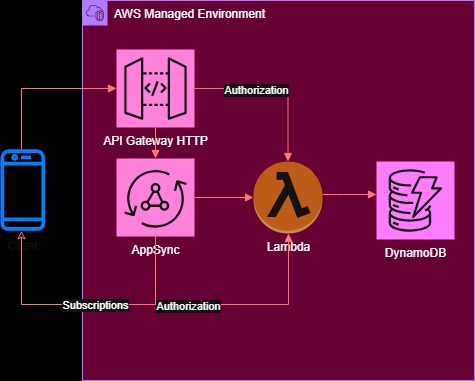

# Project: GraphQL API

This project implements a Query, Mutation, and Subscription GraphQL API using AWS services. The AWS stack was implemented using the following services and frameworks.

* API Gateway Http API - The public interface to the app which forwards requests to the GraphQL API.
* AppSync - AWS's GraphQL API implementation.  
* Lambda Functions - Provides compute resources for GraphQL resolvers and API Gateway authorization.
* DynamoDB - Used for persistence.
* JSON Web Token (JWT) - Used limit app access to logged in users.
* CodePipeline - Provides CD/CI services.  
* CloudFormation - Provides IaC services. 
* PyTest - Used for Python code unit tests.

The architecture diagram is below.

  

This API supports the following:

1. Create User - A Mutation creating a user.
1. Login - A Query for logging into the application and receiving a JSON Web Token (JWT).
1. Get User - A Query using the JWT form the login to get user information.
1. Created User - A Subscription to push Create User events to AppSync WSS clients.

AppSync provides a default resolver implementation when the datasource is DynamoDB. However, to practice implementing GraphQL APIs for other datasources that need more sophisticated processing, I implemented the Query and Mutation resolvers using Lambda Functions.  

The Query and Mutations requests are made through the API Gateway which then proxies the requests on to AppSync. Examples of calling these endpoints can be found in the Jupyter notebook found in the `client` folder of this project. 

The only work needed for the Created User Subscription was updating the schema with a subscription specification, AppSync takes care fo the rest. If more complicated processing was needed, a resolver could have been added. The `client` directory also has an example a Subscription client.   

The AppSync service uses token and Lambda authentication. For Query and Mutation requests, the API Gateway appends an AppSync authorization token to the request header before proxying the request to AppSync. The Get User Query has been implemented to require a JWT that can be retrieved using the Login endpoint after a user has been created. The Created User subscription uses Lambda authorization by passing the the JWT.    

### Lessons Learned

Compared to using frameworks like FastAPI and Graphene, AWS AppSync provide an easier way to implement and host GraphQL APIs. In addition to providing serverless hosting, AppSyn takes care of the schema validations of RESTful messages that otherwise would have to be done using something like Pydantic. Furthermore, AppSync makes implementing a WSS push service trivial.
