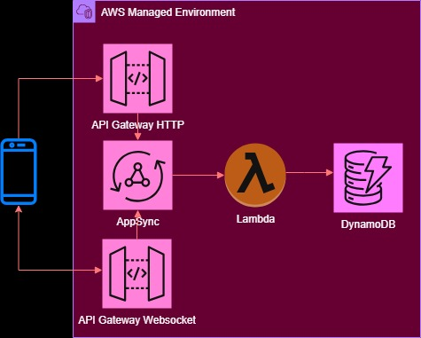

# Lambda-DynamoDB Project

A WORK-IN-PROGRESS

* API GW Http API
* API GW Websockets
* Lambda in Docker
* DynamoDB
* JSON Web Token (JWT)
* CodePipeline
* CloudFormation create and update pipelines
* PyTest

The architecture diagram is below.

  

# TODO

Need to figure out how GraphQL handles missing data. 
May need to specify response models. 
And how to return missing data exception. can't just return status 500 in else condidtion.

