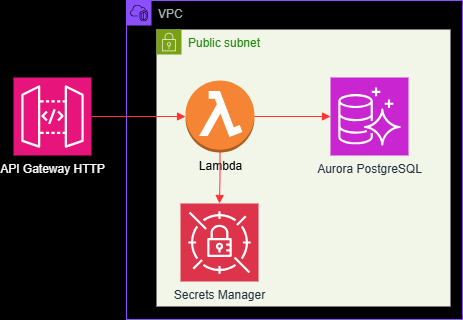

# Project: Connecting to RDS From Lambda

This is a simple project experimenting in connecting to a RDBMS from a Lambda Function:

* The Lambda Functions is implemented in a Docker image. 
* An Aurora PostgreSQL database is used for persistence.
* The data model consists of a `Users` table.
* A RESTful API Gateway provides access to the Lambda Function.
* SQLAlchemy is used for an ORM API.
* Secrets Manager is used to store RDS credentials. 
* The `client` directory has a notebook containing example of calling the API Gateway.
* Pydantic is used to validate requests in the Lambda endpoints.

AWS CloudFormation is used to provision all the resources and CodePipeline to deploy and update the CloudFormation stack. 

The architecture diagram is below.

  

The data model is very simple. It consists of one table called `Users`. The API Gateways has endpoints to create the schema in PostgreSQL, add users, and get users. 

