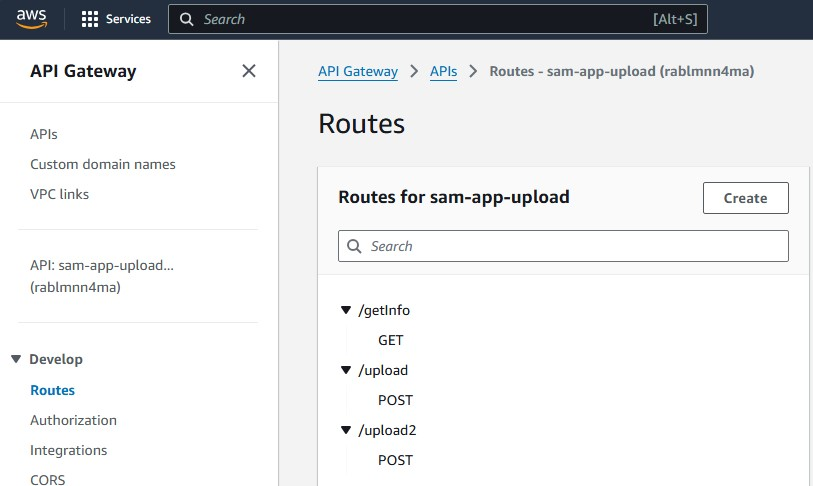
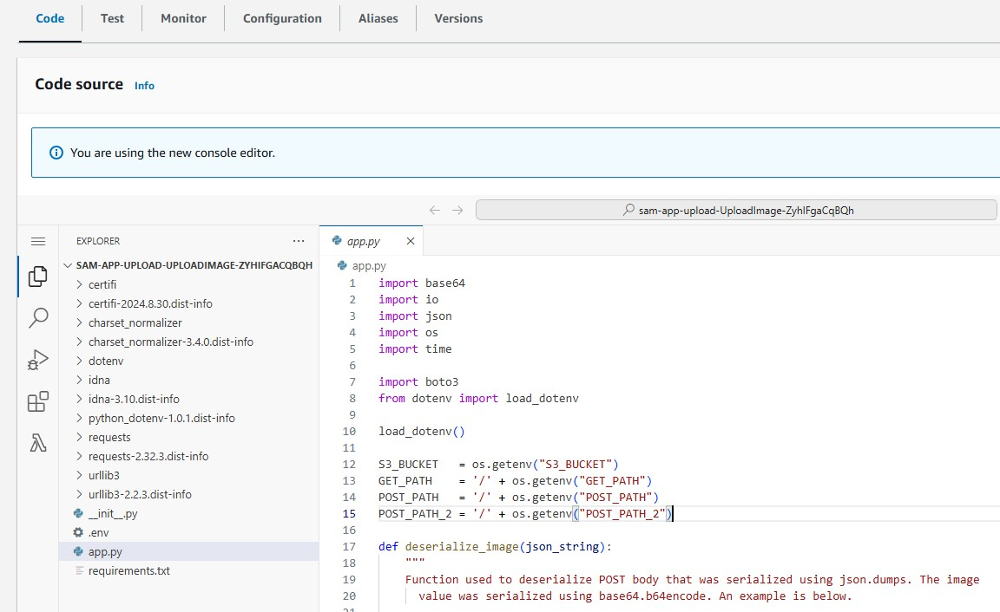

# Project: AWS SAM Lambda File Upload

This project contains source code and supporting files for an AWS serverless application to load images to Amazon S3 and identify objects in the picture using a Lambda endpoint. The AWS Serverless Application Model (SAM CLI) is used for deployment. SAM CLI is an extension of the AWS CLI that enables building and testing AWS applications. VS Code's AWS Toolkit extension is used for integration with AWS.

## Lambda Implementation

The Lambda function in this project expects an image file and does a couple things:

1. Post the image to S3.
1. Uses Rekognition to get the labels of objects found in the image.
1. Returns the labels found in the Lambda response to the calling client.

The code is pretty simple but does show how easy it is to integrate Lambda with other AWS services.

## Project Setup

The steps below reflect creating a project on a Windows 11 system using VS Code as the IDE.

You'll need an AWS account to execute these steps.

### Basic Setup

1. Install the AWS CLI and configure it with an AWS account's credentials.
1. Install the AWS SAM CLI. 
1. In VS Code, install the AWS Toolkit extension.

### SAM Initialization

Below are the steps used to initial the SAM project.

1. Create a project directory and make it the working directory in the PowerShell command-line.
1. Run the `sam init` do the following:
    1. Select the "AWS Quick Start Templates" template.
    1. Select the "Hello World Example" template.
    1. When prompted to use the most popular runtime, select 'N'. Then select the python3.12 runtime.
    1. Select the Zip package type.
    1. Accept the default for the remaining prompts. One default prompt you may want to change is the project hame. I stuck with `sam-app-upload`.

Upon completion, a directory using the project name should have been created with the directory tree below.

```
.
└── sam-app-upload
    ├── README.md
    ├── __init__.py
    ├── events
    │   └── event.json
    ├── hello_world
    │   ├── __init__.py
    │   ├── app.py
    │   └── requirements.txt
    ├── samconfig.toml
    ├── template.yaml
    └── tests
        ├── __init__.py
        ├── integration
        │   ├── __init__.py
        │   └── test_api_gateway.py
        ├── requirements.txt
        └── unit
            ├── __init__.py
            └── test_handler.py
```

## Customizing the SAM Example Project

The following customizations were made to the SAM template project. 

1. The `hello_world` directory contains the code an package requirements that will be deployed to AWS Lambda. I renamed this directory `upload`.
1. The `app.py` file contains the event handler code which will be run in the Lambda function. I modified this file to accept `GET` and `POST` requests. Please see the `app.py` file for more details.
1. The `template.yaml` describes the resources that will be provisioned on AWS. The SAM CLI will use this file during deployment. I made a number of modifications. The most import of which are under the `Resources` section:
   1.  The `Properties`->`CodeUri` was updated to point to directory where the Lambda code is kept, `upload` (which I renamed from `hello_world` above).
   1. Under `Policies`, permissions for access to logs and and AWS S3 are added.
   1. Under `Events`, an API Gateway is added. The type used is `HttpApi`. The paths specified will be used by the Lambda code to distinguish between the request types.  

Below is the directory tree after the customizations.

```
.
└── sam-app-upload
    ├── README.md
    ├── __init__.py
    ├── events
    │   └── event.json
    ├── samconfig.toml
    ├── template.yaml
    ├── tests
    │   ├── __init__.py
    │   ├── integration
    │   │   ├── __init__.py
    │   │   └── test_api_gateway.py
    │   ├── requirements.txt
    │   └── unit
    │       ├── __init__.py
    │       └── test_handler.py
    └── upload
        ├── __init__.py
        ├── app.py
        └── requirements.txt

```

## Deploying The Application

### Build The Application

The command below builds the application. Run it in a VS Code PowerShell terminal. Be sure the current directory is the project directory created by the SAM CLI.

```bash
sam build 
```

A directory called `.aws-sam` will be created. 

NOTE: The app.py file in the `upload` directory loads properties from a `.env` file. For some reason, the `sam build` command is not including this file in the build. I had to manually move the `.env` file to the `build` directory. I have not yet figured out how to fix this.

### Deploy The Application

To deploy the application, run the PowerShell command below. Accept the defaults except for the prompts below.

1. `UploadImage has no authentication. Is this okay? [y/N]:` - This prompt is informing you that an authorization mechanism has not be specified for the API Gateway. You can proceed without having one **but be aware that anyone will be able to call you endpoint**. Proceed with caution. To stop access to the endpoint when its not being used, use the API Gateway console to manually disable the endpoint.
2. `Deploy this changeset? [y/N]:` - Select `y` to provision your application on AWS.

```bash
sam deploy --guided
```

In the CloudFormation web console, a stack called `sam-app-upload` will appear created. Use the stack's `Resources` tab to inspect all the resources created for this stack. Among them should be an API Gateway and Lambda function. 

Below is a screenshot of the API Gateway endpoint created.



Below is a screenshot of the Lambda function created.



## Testing The Application

In this distribution's `client` folder is a Jupyter notebook that can be used to test the Lambda endpoint.

## AWS Cleanup 

To delete all the resources created for this project, in the AWS console go back to the CloudFormation service and find your application in the `Stacks` screen. Select the stack and hit the `Delete` button. This will delete all the resources created for the project.


