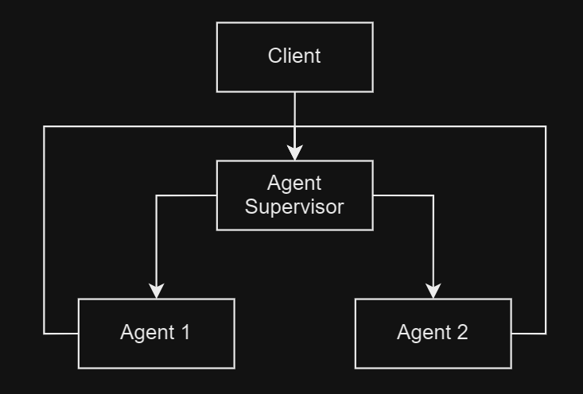

# Project: Multi-Agent Supervisor

This project was inspired by LangGraph's [video](https://www.youtube.com/watch?v=hvAPnpSfSGo) on using graphs to route user request to the correct agent. Having a router helps ensure a user's request is sent to the agent with the right set of tools to fulfill the request. 

In this project, a supervising class uses an LLM to make decisions on which agent to send a request to. LangGraph is used to route the workflow back to the supervisor after an attempt to service a request. The supervisor then determines if the request has been satisfied or further processing is required by other agents. If multiple requests are made, the supervisor will route each request to the correct agent. 

The agents managed in this project are:

1. A Salutation Agent - an agent the use an LLM to create salutations to family members and calculating the length of that salutation. This agent has a tool to generate the salutation using an LLM and another agent to calculate the salutation length.
2. A NYC Reservoir Level - an agent that returns the utilization NYC reservoirs. 

Even though the agents are simple, they illustrate the purpose of this design pattern of routing requests to the proper agent.

  

See [this notebook]() for a demonstration of the application.

