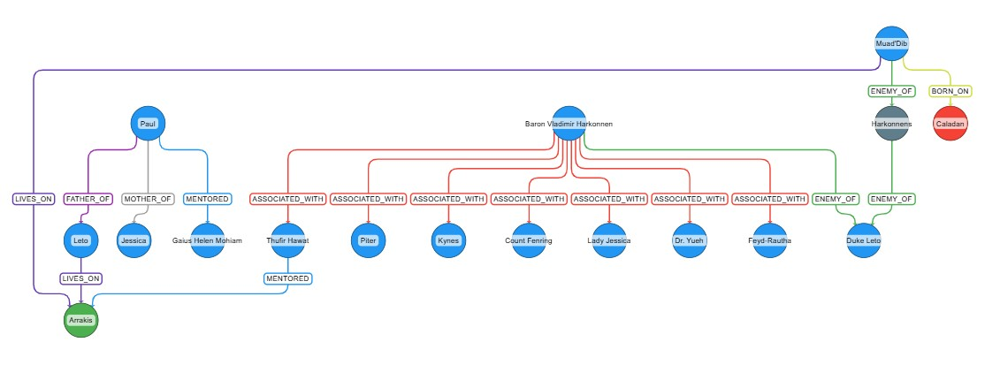

# Knowledge Graph Projects

This projects uses LangChain, OpenAI, Neo4j, and yWorks to create and utilize knowledge graphs.

 The data source for these projects is Frank Herbert's 1965 novel Dune which can be found [here](https://raw.githubusercontent.com/ganesh-k13/shell/master/test_search/www.glozman.com/TextPages/Frank%20Herbert%20-%20Dune.txt).

### Project 1

The Dune_Graph.ipynb notebook identifies and visualizes the entities and relationships found in the source text.

### Project 2 

The Dune_Graph_RAG.ipynb notebook uses a knowledge graph to enchance RAG requests.

Below is a visualizatoin of knowledge graph created by the projects above.

