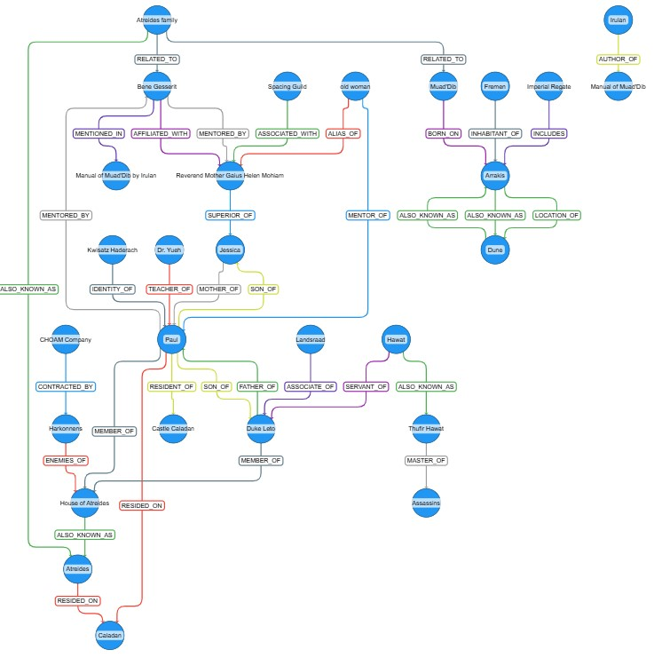

# Project: HippoRAG Implementation

This project implements retrieval-augmented generation (RAG) using techniques described in the paper, [HippoRAG: Neurobiologically Inspired Long-Term Memory for Large Language Models](https://arxiv.org/abs/2405.14831). HippoRAG is a framework that serves as a long-term memory for LLMs and is inspired by how the human brain integrates new information into long-term memory. This approach not does require a vector database when determining the context for a RAG request. 

To provide some background, basic RAG adds new knowledge not available during LLM training by retrieving indexed passages stored in a vector database through a similarity search between RAG queries and indexed content. A recognized deficiency in this approach is the integration of a multi-hop, knowledge integration across the documents retrieved through a similarity search. Techniques such as multi-step RAG which iteratively joins disparate passages have been used to address this. 

HippoRAG leverages human brain hippocampal memory indexing theory, LLMs, and knowledge graphs to tackle knowledge integration tasks. The authors of the paper  claim this approach to RAG outperforms the state-of-the-art at a fraction of the compute time. Given a new RAG request, HippoRAG leverages the results of an entity's Personalized PageRank (PPR) scores given a knowledge graph (KG) and its term-frequency (TF) in corpus splits to determine the documents to use for the RAG context. Using the exploration of a KG's connections between nodes to determine which splits of a corpus to use in a RAG request is very different form the standard similarity search typically used for RAG.

The code below divides the implementation up into the following parts. 

- Build a schemaless KG stored in a Neo4j database. 
- Create a searchable index of entity names from the KG nodes. 
- Retrieve context relevant documents using the PPR algorithm.
- Utilize the retrieved context for RAG requests.     

The modules discussed are implemented below using LangChain, OpenAI, Neo4j, Pydantic, and yWorks.  

The source corpus for these projects is Frank Herbert's 1965 novel Dune which can be found [here](https://raw.githubusercontent.com/ganesh-k13/shell/master/test_search/www.glozman.com/TextPages/Frank%20Herbert%20-%20Dune.txt).

The results of this project can be viewed in the Jupyter notebook distributed with this file. Below is visualization of the Neo4j knowledge graph created for this project.

