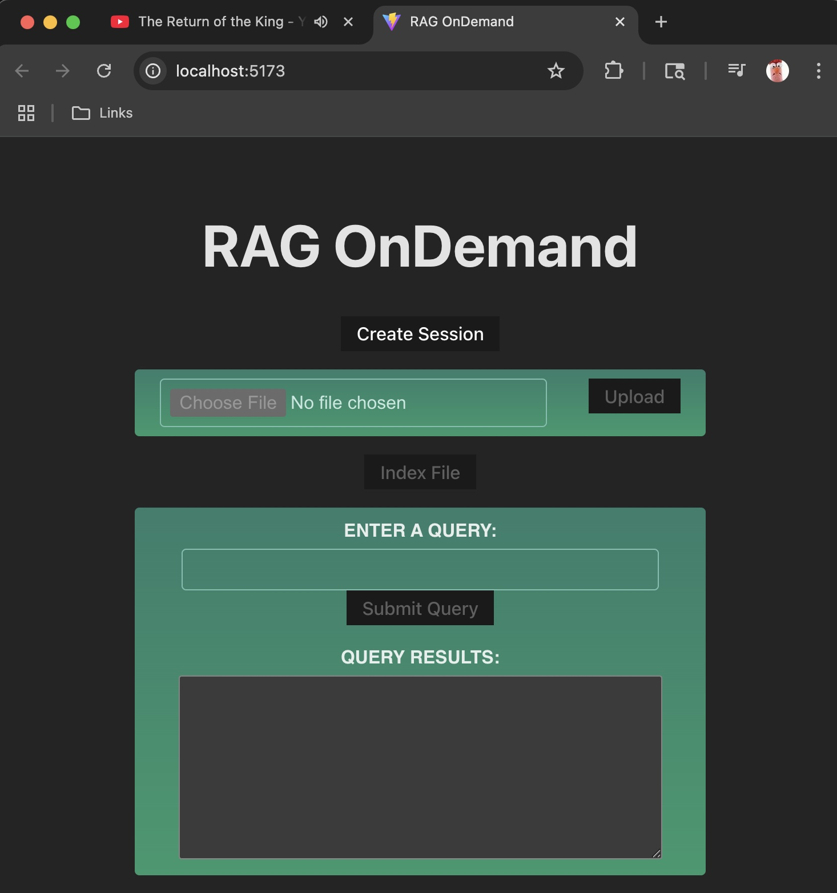

# Project: RAG OnDemand

# A WORK IN PROGRESS

This project uses AWS services and LlamaIndex to create a RAG agent API to answer questions about user provided PDFs. 

I found this [DeepLearning.AI](https://learn.deeplearning.ai/courses/building-agentic-rag-with-llamaindex/lesson/nfa5y/building-a-multi-document-agent) course very helpful, although some of the APIs have been deprecated.

The workflow for this services is as follows:

1. Using an HTTP API Gateway, users create a session and upload a PDF document.
1. Users then request to build document indices.
1. Users submit queries about the document to the service and receive responses. 

Below is the app stack:

1. FastAPI - Used to implement the microservice. 
1. OpenAI - The o4-mini model provides LLM services.
1. AWS Cloudformation/CodePipeline - Provides IaC and CI/CD services. 
1. AWS VPC - A cloud to where the service is deployed.
1. AWS API Gateway - The public API for the service. 
1. AWS ECS - Where the FastAPI instance runs, conifigured for reliability and scalability.
1. AWS ECR - Where the ECS Docker images are stored.
1. AWS S3 - Where the LlamaIndex indices are stored.
1. s3fs - A Python module that enables LlamaIndex to accessing S3 like a file system.

The architecture:

<p align="center">
  
</p>

## Implementation Details

### Client

The `clients` folder contains:

1. Script clients: Examples of calling the API using a Jupyter notebook and a load simulator.
1. React client: A React app used to call the API. The `create-pipeline` (described below), deploys the React app to S3. The screenshot below shows the React app being run locally.
 
<p align="center">
  
</p>

### The RAG Agent

The module `src/util/lama_index_util.py` provides functions to interact with LlamaIndex. Two indices are built for documents uploaded by a user: An index for summary questions and another for detailed questions. These indices are wrapped using query engine tools and provided to a LlamaIndex `FunctionAgent` instance whose agentic workflow determines which tool to use.

### LlamaIndex and S3

The service is stateless. To avoid having to rebuild the vector indicies used for making the RAG requests for each request, the indices are stored in AWS S3. When persisting files, LlamaIndex has alternatives to using the files system. It supports the [fsspec](https://filesystem-spec.readthedocs.io/en/latest/intro.html) standard which is an attempt to provide a common interface for files. The Python module [s3fs](https://github.com/s3fs-fuse/s3fs-fuse) provides an implementation of this standard for AWS S3. The service uses `s3fs` to store the file index file in S3.

### IaC and CI/CD

The `cloudformation` directory contains three pipelines.

1. `create-app` - The IaC that defines the AWS stack.
1. `create-pipeline` - A CodePipeline used to build the Docker image and deploy the stack defined in `create-app`.
1. `update-pipeline` - A CodePipeline used to rebuild and deploy the Docker image to ECS.

## Configuration Notes

### CloudFormation

When using the CloudFormation `create-pipeline`, the properties need to set with your own values in the file `./cloudformation/create-pipeline/buildspec.yml`. These properties are used to populate app property files.

- S3_BUCKET - S3 bucket used to upload files to and store LlamaIndex indicies. 
- AWS_KEY - Key credential of an AWS user with access to S3_BUCKET. 
- AWS_SECRET - Secret credential for an AWS user with access to S3_BUCKET.
- OPENAI_API_KEY - OpenAI key used by LlamaIndex to make LLM queries.
- REACT_S3_BUCKET - S3 bucket where React application is deployed. This bucket will need to be made public and use the following bucket policy:

```bash
{
    "Version": "2012-10-17",
    "Id": "ReadOnlyPolicy",
    "Statement": [
        {
            "Sid": "Allow_PublicRead",
            "Effect": "Allow",
            "Principal": "*",
            "Action": "s3:GetObject",
            "Resource": "arn:aws:s3:::<YOUR BUCKET NAME HERE>/*"
        }
    ]
}
```

### Docker

If the Docker image is built without using CloudForamtion, the same properties above will need to be populated in the file `./src/.env`.

### React Web App

The last step in CloudFormation `create-pipeline` is to create a property file for the React app. This file contains the API Gateway URL is copied to `REACT_S3_BUCKET` described above.

## Lessons Learned

LlamaIndex makes it easy to develop RAG services. The load testing I did discovered bottlenecks I hadn't considered. In this case, the token rate limit for my OpenAI account limited the number of simultaneous requests I could make to the service. It was also easy to build a frontend client using React. 
