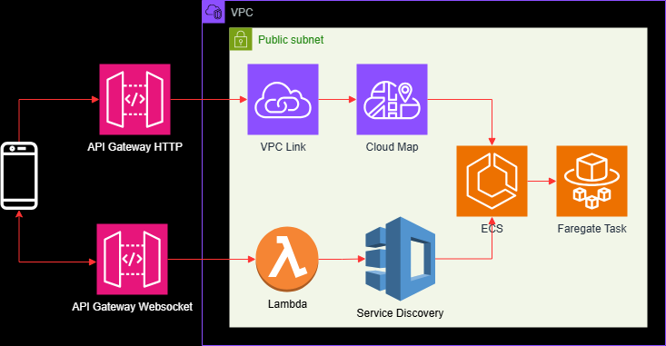
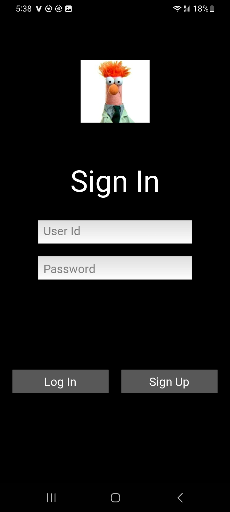
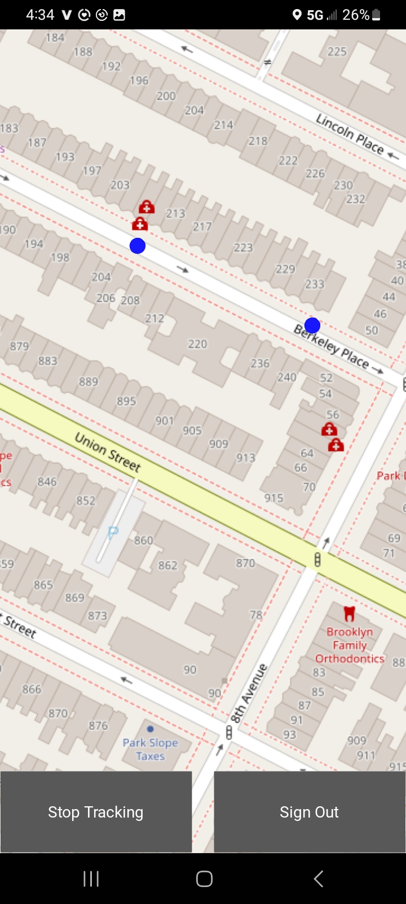

# Project: Mobile Device Tracker

This project demonstrates using Python, AWS, and Kivy (a cross-platform GUI framework for Python) to implement a mobile device tracker. Highlights include:

* A RESTFul API web service implemented using FastAPI running on ECS
* IaC using CloudFormation
* CI/CD using CodePipeline
* HTTP and WebSocket API Gateways
* AWS Lambda functions including an API Gateway Authorizer
* Using Docker images for Lambda and ECS code
* ECS integration with API Gateway
* Using SQLAlchemy for SQLite persistence
* A Kivy mobile app that sends GPS location info to the web service API
* PyTest for unit testing

The Kivy mobile app reports its GSP location to an application stack deployed to AWS. The mobile app uses Kivy Garden MapView to visualize the device location and any other device logged into the service.  

I made some architecture decisions to reduce the cost of deploying this app to AWS: 

* Cloud Map instead of an Application Load Balancer is used integrate API Gateway and ECS.
* To avoid the expense of a NAT Gateway, all resources are deployed to a single public subnet. 

A couple of additional notes:

* Lambdas deployed to a public subnet have no internet access, so VPC Interface Endpoints are used to access AWS services.
* The ECS service is secured by using its security group to restrict inbound access to API Gateway, Cloud Map, and Lambda.   
* Some of the AWS services used were for self-didactic teaching. For example:
  * A Lambda Authorizer was included to experiment with securing an API Gateway. 
  * ECS and FastAPI are used to implement the endpoints instead of Lambda Functions.
  * SQLite and SQLAlchemy are used to experiment with Python RDBMS persistence. 
 
A final note on costs. For small ECS clusters, the AWS cost for public IPs and VPC endpoints is less than that of NAT gateways. Furthermore, an application load balancer is more expensive than Cloud Map. For larger clusters, this is probably not true.

The architecture diagram is below.

<p align="center">
  
</p>

The API Gateway HTTP handles sign-ins and creating users. The API Gateway WebSocket handles GPS updates sent by the Kivy client installed on mobile devices.

# Test Suite

A PyTest suite can be run using the `./docker/test/TestSuite.py` script.

# AWS Deployment

In the directory `./cloudformation/` are three AWS CodePipelines to deploy and maintain this application.

- Create Pipeline: Runs the CloudFormation templates found in the directory `./cloudformation/create-app` to create the application.
- Update Lambda Pipeline: Update the Lambdas with the latest code. 
- Update Pipeline: Update the AWS ECS task with the latest code. 

As soon as any of these pipelines are deployed to AWS, it executes. Therefore, be sure to create the `Create Pipeline` first and let it finish. The two update pipelines only need to be run if the ECS or Lambda needs to be updated after the stack's initial deploy. The following SAM CLI commands were used to build and deploy the pipelines.

```bash

sam build
sam deploy

```

Four AWS resources are not provisioned by `create-pipeline` and need to be manually created before running any of the pipelines:

1. The AWS Developer Tools GitHub Connection referenced by the `GitHubConnectionArn` property in the pipeline templates will need to be manually created in any AWS account trying to run these pipelines. The connection needs to point to where this code is stored and it's ARN used to update the pipeline template's property. For this project, the code was stored in the Git Hub repository `https://github.com/efarish/portfolio`. 
2. An AWS ECR repository with the name `ecs1` is assumed to exist. This repository is referenced by the CloudFormation templates and the pipeline `buildspec.yml` files.
3. CodePipeline requires an S3 bucket. To run these pipelines, replace the `S3ArtifactBucket` values in the template files with a bucket from the AWS account the pipelines are run in.
4. `Create Pipeline` pushes a configuration file called `config.json` containing the latest API Gateway HTTP And Websocket URLs to a public S3 bucket called `s3://a-unique-public-bucket-name`. The Kivy client makes an HTTP request to this this bucket to get `config.json` files.  

# Clients

Below are clients provided in this project to interact with AWS.  

## Jupyter Notebook

In the `client` directory is a Jupyter notebook that has examples of called the AWS API Gateway HTTP API.

## A WebSocket Python Script

A script demonstrating sending and receiving message to the AWS API Gateway WebSocket API. 

## Kivy Client

A Kivy client in the `kivy` directory is provided to interact with the AWS service and visualize the location of devices signed into the app.

### Kivy Android Deployment

I've done another project that goes into the details of setting up a Kivy Android deployment environment using Buildozer. Please see [this](https://github.com/efarish/portfolio/tree/main/mobile/kivy_img_post) project for details. 

### Kivy IOS Deployment

To deploy the Kivy app to an IOS device, I used a Mac workstation and the [kivy-ios](https://github.com/kivy/kivy-ios) framework. I found these resource useful in setting it up.

* [This](https://www.youtube.com/watch?v=6gLGyrlgqCU) Youtube video to set up the environment.
* The [Kivy-ios](https://github.com/kivy/kivy-ios) documentation for reference.

#### Addition IOS Configuration

1. In addition to the configuration discussed in the video above, I added the dependencies below:
  - python toolchain.py pip install httpx
  - python toolchain.py pip install git+https://github.com/kivy/plyer.git@master
  - python toolchain.py pip install httpcore
  - python toolchain.py pip install anyio
  - python toolchain.py pip install certifi
  - python toolchain.py pip install idna
  - python toolchain.py pip install h11
  - python toolchain.py pip install openssl
2. The Kivy Garden MapView code appears to have a bug when running on a IOS device. The MapView code attempts to create a cache for the map images to a directory it doesn't have permission to. I cloned the project from GitHub and made the following change to the `kivy_garden/mapview/constants.py` to put the cache in directory the app would have access to:
```bash
if platform == 'ios': 
  root_folder = App().get_running_app().user_data_dir
  CACHE_DIR = os.path.join(root_folder, 'cache')
else:
  CACHE_DIR = "cache"
```   
Use the command below to install the modified MapView package, 
```bash
python toolchain.py pip install $< PATH TO THE CLONED MAPVIEW DIRECTOY >
```
3. When using Xcode to deploy to a IOS device, I had to edit the Xcode projects's Info.plist (in this project the file was called gps_tracker-Info.plist) with the following entry to the <dict> element. This allows the target device to access the GPS location: 
```bash
<key>NSLocationWhenInUseUsageDescription</key>
<string>${PRODUCT_NAME}</string>
```

# Kivy Demo

Below is a demo of the Kivy demo code located in the `kivy` directory. This simple app has three screens: 

1. A Sign-in screen.
1. A Sing-up screen.
1. A map showing the location of user logged into the service. 

Below is a screen shot of the Sign-in screen.

<p align="center">
  
</p>

For the next screenshot, the Kivy app was installed to Android and iPhone devices. The blue dots are the GPS coordinates of the two phones which were first transmitted and then broadcasted to the signed-in users using a API Gateway Websocket.

<p align="center">
  
</p>

# Clean Up 

### CloudFormation Stacks

In the AWS CloudFormation console, delete the root stacks created for this project in the following order. 

1. tracker-create-pipeline-app-stack
2. gps-tracker-lambda-update
3. gps-tracker-update-pipeline
4. gps-tracker-create-pipeline

Let the deletion of each stack finish before deleting the next.

**NOTE: The order of stack deletion is very important.** Deleting the pipeline stacks before the app stack will cause many problems. The IAM role created by the Create Pipeline stack is needed to delete the application stack. Delete the application root stack first, then delete the pipeline stacks. If the pipeline stacks are mistakenly deleted first, deleting the application stack will fail with an error stating a certain role cannot be assumed. To fix, manually create an IAM role with the same name using the policy defined in the `create-pipeline` template.  

### ECR Images

The Docker images in the `ecs1` repository created for this project need to be deleted.

### S3 Buckets

Delete the buckets created for the pipelines.

### Github Code Connection

Delete the AWS Developer Tools Code Connections to Github created for this project.

# Conclusions

* The costs of AWS stacks can be significantly reduced with a few architecture decisions,
* The up-front effort of implementing CI/CD pipelines and IaC templates reduces development time.
* Mobile apps are fun.

# Future Work

* Create a version of this app with all Python code in Lambdas.
* Use an AWS service for persistence.
* Create a React Native mobile client.
* In Kivy client: add inactivity logout, JWT timeout reconnects, and reconnect on websocket drop.


