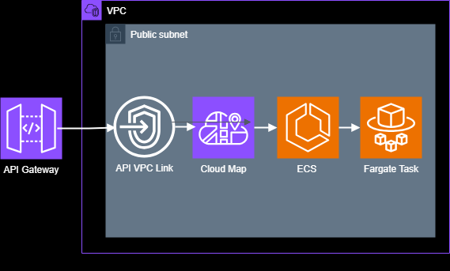

# Mobile GPS Tracker

WORK-IN-PROGRESS

This project focuses on implementing a REST API using FastAPI and AWS ECS. To make it more interesting, a Kivy mobile application client is also implemented. Furthermore, to reduce the cost of the resources deployed on AWS, reliability and scalability considerations are ignored. Therefore, a single low capacity Fargate launch type is used.

## Notes

salt = bcrypt.gensalt(rounds=10, prefix=b'2a')
JWT_SECRET_KEY = openssl rand -hex 32

docker build -t gps/tracker .

aws ecr get-login-password --region us-east-1 | docker login --username AWS --password-stdin <AWS ACCT ID>.dkr.ecr.us-east-1.amazonaws.com

docker tag gps/tracker <AWS ACCT ID>.dkr.ecr.us-east-1.amazonaws.com/ecs1:tracker

docker push <AWS ACCT ID>.dkr.ecr.us-east-1.amazonaws.com/ecs1:tracker

```bash

cd ./cloudformation
sam build
sam deploy

````

```bash

sam delete

```

```bash
sam build --template .\template_pipeline_stack.yaml

```

<p align="center">
  
</p>

# Customizations

1. template_pipeline_stack.yaml -> GitHubConnectionArn