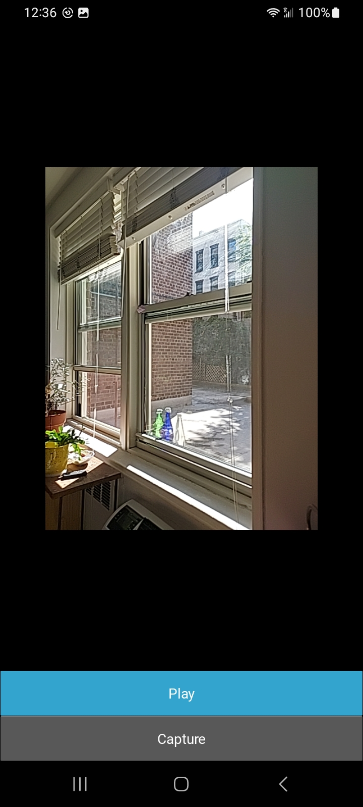
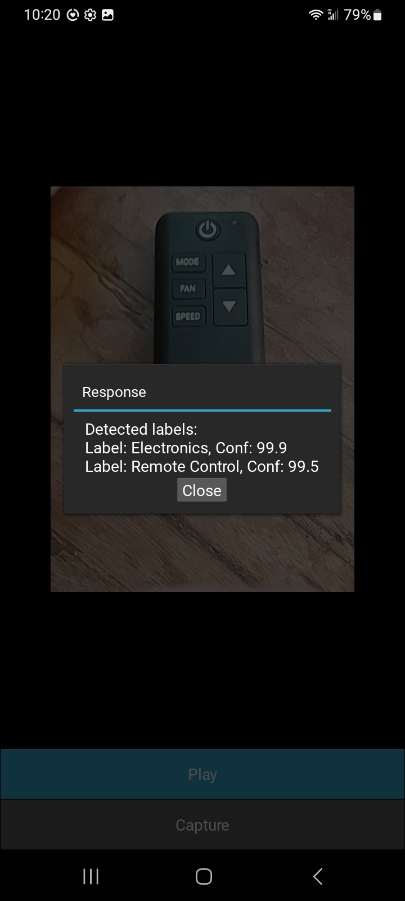
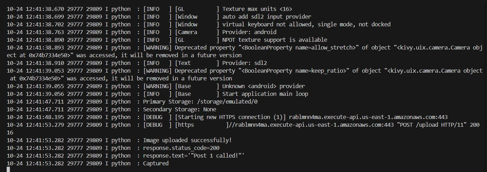

# Project: Using Kivy and Python To Create An Android Phone App

This project uses the open-source Kivy framework to build a simple Python app for an Android phone. The app uses the phone's camera to take a picture, copy the image to the phone's download directory, and post the picture to an HTTP endpoint.

To avoid having to provide an endpoint to run the app, the Python POST request in the `main.py` script can be removed. For my development, I used a AWS API Gateway/Lambda endpoint deployed using a project I developed. The code and steps for deployment can be found [here](https://github.com/efarish/portfolio/tree/main/aws/sam_lambda_s3). The Lambda function for that project also uses AWS Rekognition to identify the objects in the picture and returns the labels for the objects found to the calling client. 

The hardest part of this projects was setting up the development workstation. I provide the details of doing that below.

## Setup Development Environment

### Device Setup

I used a Galaxy A42 5G phone for this project. To put it in developer mode, I followed these [steps](https://www.youtube.com/watch?v=VspNNL6mMSk).

### OS and IDE

I used Windows 11 and VS Code v1.94.2.  

### Installations

Below are the required installations for this project. Prior to executing these steps, I found watching this [video](https://www.youtube.com/watch?v=YByZ_sOOWsQ) very helpful.  

1. The following steps require a Windows Subsystem for Linux (WSL) installation. I followed these [steps](https://www.youtube.com/watch?v=YByZ_sOOWsQ) to install WSL. During the install, you'll be prompted to create a default Unix user account in an Ubuntu subsystem.
1. After the installation and if you're not already in the Ubuntu environment, use this PowerShell command to connect: `wsl -d Ubuntu`
1. In your home directory, create a project folder and make it your working directory.
1. Copy this distribution's `main.py` file into the Ubuntu project directory. The Windows partition can be accessed from Ubuntu using the `/mnt/c` mount.
1. To install the Kivy framework, follow the instructions [here](https://kivy.org/doc/stable/gettingstarted/installation.html#install-pip) for the Target `Android on Windows 11`. A summary of the steps I used are below.
    1. At a PowerShell prompt, make your project folder your working directory.
    1. `python -m pip install --upgrade pip setuptools virtualenv`
    1. `python -m venv .kivy_venv`
    1. `source .kivy_venv/bin/activate`
    1. `python -m pip install "kivy[base]"`
1. In the Ubuntu virutal environment created above, install the Buildozer utility using the steps located [here](https://buildozer.readthedocs.io/en/latest/installation.html). This utility will be used to create an Android application package (apk). 
    1. **NOTE**: When running of the steps linked above, I got an error saying that `libtinfo5` could not be installed. I removed this library from the `sudo apt install` installation step that referenced the library and was able to complete the install. This seems to have no effect on the successful completion of this project.
1. Install Android Debug Bridge in the Windows and Ubuntu environments. This utility allows for installing the app from your workstation and viewing debug messages generated by the Python code running on the Android phone. 
    1. For Windows, download [this](https://developer.android.com/tools/releases/platform-tools).
    1. For Ubuntu, use the same link above to download the files or run this: `sudo apt install adb` 

## The App

Most of the code contained in this distribution's `main.py` file came from the Kivy example found [here](https://kivy.org/doc/stable/examples/gen__camera__main__py.html). I customized it make a HTTP request to a HTTP endpoint. As mentioned above, If you don't have an endpoint available taht can accept an image POST, thoses lines can be removed from the script.

## Project Build

### Buildozer Initialization

In the project folder in the virtual environment created above, initialize the Buildozer android package creation utility by running the command `buildozer init`. This will create a `buildozer.spec` file that controls the build and deployment processes. 

### Buildozer Customization

I customized the following properties in the default `buildozer.spec` file created by the intialization step. These properties names already exist in the file. I just uncommented them (when needed) and changed their values. 

* App name that appears for the Android install: `title = Cam App`
* App icon on Android: `icon.filename = %(source.dir)s/bkr.png`
* Need permissions: `android.permissions = android.permission.INTERNET, (name=android.permission.WRITE_EXTERNAL_STORAGE;maxSdkVersion=18), CAMERA`

### Build The Android Package (APK)

Run the command below in the project directory. Check that `buildozer.spec` and `main.py` files are in this directory. The build may take a long time to run. On an Intel Core Ultra 7 laptop with 12 cores and 16 gigs of memory it took almost 15 minutes.

```bash
buildozer android clean
buildozer android debug 
```

Assuming the build is successful, a director called `bin` should have been created containing file with a file wiht an `.apk` extension. This is your android package. 

## Phone Connection Setup

A connection between your workstation and the Android phone will now be created.

### Put Andriod Phone in Developer Mode

To put a Galaxy A42 phone in developer mode, I followed the steps in this [video](https://www.youtube.com/watch?v=VspNNL6mMSk&t=6s).

### Windows

Open a Windows Powershell and run the Andriod Bridge commands below. Be sure to be in the directory where the Andriod Bridge utility was unzipped to during the install steps above.   

```bash
./adb.exe --version
./adb.exe devices
./adb.exe tcpip 5555
./adb.exe connect <YOUR PHONE IP HERE>:5555
./adb.exe devices
```
The last statement should list your connected phone.

### Ubuntu

In a WSL Ubuntu environment shell, run the following Andriod Bridge commands. Be sure to pay attention to the device you are connecting to as you may be prompted to allow the connection.

```bash
adb connect <YOUR PHONE IP HERE>:5555
adb devices
```

The last statement should list your connected phone.

## Deployment

In the project directory on Ubuntu, run the command below. This will deploy the android package to the connected phone.

```bash
adb -s <YOUR PHONE IP HERE>:5555 install ./bin/FILE NAME OF PACKAGE CREATED IN THE BUILD ABOVE.apk
```

When running this command, pay attention to your phone as you may be prompted to allow the app to access your phone.

Check that the app was installed to your phone. You should see the `bkr.png` icon with a `Cam App`  label on your phone. 

## Run The App

Click on the icon and the app should start. On my phone, after hitting the `Play` button, the app looks like the screenshot below.



Taking a picture submits the image to the endpoint. The AWS endpoint used for the project saves the file to AWS S3 and uses AWS Rekognition to identify the objects in the picture. Below is a screenshot of the app in action.



## Start Debugging

To view debug debug message as the app is running, in an Ubuntu shell, run the command below.

```bash
adb -s <YOUR PHONE IP HERE>:5555 logcat *:S python:D
```

You should now see some debug messages. Click the app's `Capture` button to generate some additional debug messages.

If you provided an endpoint that can accept POSTs of image files, the endpoint should have received the picture taken by the camera. The picture taken was also put in the Andriod phone's download directory. On a Galaxy A42, that is `/storage/emulated/0/Download/`. You can view the download directory form your phone's Files app. 

Below is example debug output.



## Conclusion

While not complicated, this projects demonstrates using Python code to develop a mobile application for an Android phone. Buildozer also supports creating deployments for the Apple iPhone as well. Furthermore, being able to post data to endpoints allows for integration with cloud service providers like IBM, AWS, and Google. 


